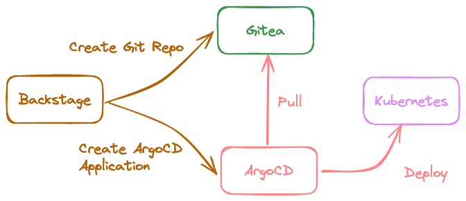

# Reference Implementation
The idpbuilder reference implementation allows you to create and manage internal developer platforms effortlessly by leveraging Kubernetes-native features through CNOE. The reference implementation simplifies the development, testing, and deployment lifecycle by providing pre-configured settings that integrate seamlessly with local infrastructure.

## Prerequisites
Before starting the installation process, ensure the following prerequisites are met:

- idpbuilder: version 0.7.0 or later
- kubectl: version 1.29 or later
- Your system should have at least 8 GB RAM allocated to Docker/Podman container engine.

## Installation
`Note`: _This example assumes that you run the reference implementation with the default port configuration of 8443 for the idpBuilder. If you happen to configure a different host or port for the idpBuilder, the manifests in the reference example need to be updated and be configured with the new host and port.

Use the following command to install the stack:

```bash
idpbuilder create --use-path-routing \
  --package https://github.com/cnoe-io/stacks//ref-implementation
```

## Installation Review
It will few minutes to deploy everything. Let's take a look at what we deployed:
* A Kind cluster 
* Gittea
* Ingress-NGINX
* ArgoCD 
* Argo Workflows to enable workflow orchestrations.
* Backstage as the UI for software catalog and templating.
* Crossplane, AWS providers, and basic compositions for deploying cloud related resources (needs your credentials for this to work)
* External Secrets to generate secrets and coordinate secrets between applications.
* Keycloak as the identity provider for applications.
* Spark Operator to demonstrate an example Spark workload through Backstage. 

<p align="center">
    
</p>

## Accessing the UI

Argo CD: (https://cnoe.localtest.me:8443/argocd)
Argo Workflows: (https://cnoe.localtest.me:8443/argo-workflows)
Backstage: (https://cnoe.localtest.me:8443/)
Gitea: (https://cnoe.localtest.me:8443/gitea)
Keycloak: (https://cnoe.localtest.me:8443/keycloak/admin/master/console/)

We will walk through a few demonstrations. Once applications are ready, go to the [backstage URL](https://cnoe.localtest.me:8443/) .

Click on the Sign-In button, you will be asked to log into the Keycloak instance. There are two users set up in this configuration, and their password can be retrieved with the following command:

```bash
idpbuilder get secrets | grep USER_PASSWORD
  USER_PASSWORD : ****
```

Use the username user1 and the password value given by USER_PASSWORD field to login to the backstage instance. user1 is an admin user who has access to everything in the cluster, while user2 is a regular user with limited access. Both users use the same password retrieved above.

## Cleaning Up Resources
You can use the following command to destroy the CNOE deployment:

```bash
idpbuilder delete
```


