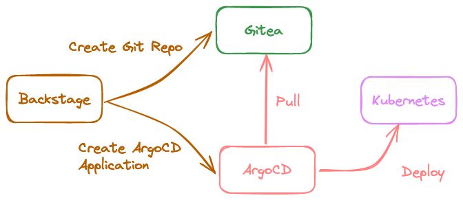

# Reference Implementation
The idpbuilder reference implementation allows you to create and manage internal developer platforms effortlessly by leveraging Kubernetes-native features through CNOE. The reference implementation simplifies the development, testing, and deployment lifecycle by providing pre-configured settings that integrate seamlessly with local infrastructure.

## Installation

Use the following command to install the stack:

```bash
idpbuilder create --use-path-routing \
  --package https://github.com/cnoe-io/stacks//ref-implementation
```

## Installation Review
It will take just a few minutes to deploy everything. Let's take a look at what we deployed:

```bash
kubectl -n argocd get apps
NAME                  SYNC STATUS   HEALTH STATUS
argo-workflows        Synced        Healthy
argocd                Synced        Healthy
backstage             Synced        Healthy
backstage-templates   Synced        Healthy
external-secrets      Synced        Healthy
gitea                 Synced        Healthy
keycloak              Synced        Healthy
metric-server         Synced        Healthy
nginx                 Synced        Healthy
spark-operator        Synced        Healthy
```
You should have a similar result after a successful installation of the stack: 

```bash
kubectl get po -A | grep -iv kube-system
NAMESPACE            NAME                                                READY   STATUS      RESTARTS   AGE
argo                 argo-server-6cfdd5ffd7-sdbxq                        1/1     Running     0          53s
argo                 workflow-controller-997b58f6d-b2pnc                 1/1     Running     0          20m
argocd               argocd-application-controller-0                     1/1     Running     0          21m
argocd               argocd-applicationset-controller-6c6d75b86f-s9zvf   1/1     Running     0          21m
argocd               argocd-redis-6668955c45-82cr2                       1/1     Running     0          21m
argocd               argocd-repo-server-7fd9bd6445-tfjkn                 1/1     Running     0          21m
argocd               argocd-server-5db575d9fb-mhbq8                      1/1     Running     0          21m
backstage            backstage-54d9f67c8d-552qv                          1/1     Running     0          13m
backstage            postgresql-0                                        1/1     Running     0          13m
external-secrets     external-secrets-77d6658564-klf25                   1/1     Running     0          20m
external-secrets     external-secrets-cert-controller-754b859548-s6g7q   1/1     Running     0          20m
external-secrets     external-secrets-webhook-85d48758f-2wxpd            1/1     Running     0          20m
gitea                my-gitea-6847557d4d-f6zdl                           1/1     Running     0          23m
ingress-nginx        ingress-nginx-admission-create-wpfl8                0/1     Completed   0          23m
ingress-nginx        ingress-nginx-admission-patch-l6756                 0/1     Completed   0          23m
ingress-nginx        ingress-nginx-controller-795dfd6796-6xbm9           1/1     Running     0          23m
keycloak             config-dfcsk                                        0/1     Completed   0          17m
keycloak             keycloak-5b6dfcc974-5272b                           1/1     Running     0          19m
keycloak             postgresql-0                                        1/1     Running     0          20m
local-path-storage   local-path-provisioner-6fdc965494-pbcpb             1/1     Running     0          23m
spark-operator       spark-operator-7ff7d69878-6spdq                     1/1     Running     0          20m
```

- A Kind cluster 
- Gittea
- Ingress-NGINX
- ArgoCD 
- Argo Workflows to enable workflow orchestrations.
- Backstage is the UI for software catalog and templating.
- External Secrets to generate secrets and coordinate secrets between applications.
- Keycloak as the identity provider for applications.
- Spark Operator to demonstrate an example Spark workload through Backstage. 

<p align="center">
    
</p>

## Accessing the UI

- Argo CD: (https://cnoe.localtest.me:8443/argocd)
- Argo Workflows: (https://cnoe.localtest.me:8443/argo-workflows)
- Backstage: (https://cnoe.localtest.me:8443/)
- Gitea: (https://cnoe.localtest.me:8443/gitea)
- Keycloak: (https://cnoe.localtest.me:8443/keycloak/admin/master/console/)

We will walk through a few demonstrations. Once applications are ready, go to the [backstage URL](https://cnoe.localtest.me:8443/).

Click on the Sign-In button, and you will be asked to log in to the Keycloak instance. There are two users set up in this configuration, and their passwords can be retrieved with the following command:

```bash
idpbuilder get secrets -p keycloak | sed -n 's/.*USER_PASSWORD=\([^,]*\).*/\1/p'
****
```

Use the username user1 and the password value given by the `USER_PASSWORD` field to log in to the backstage instance. `user1` is an admin user who has access to everything in the cluster, while `user2` is a regular user with limited access. Both users use the same password retrieved above. If you want to create a new user or change existing users, please see [here](https://cnoe.io/docs/reference-implementation/idp-ref#if-you-want-to-create-a-new-user-or-change-existing-users)
