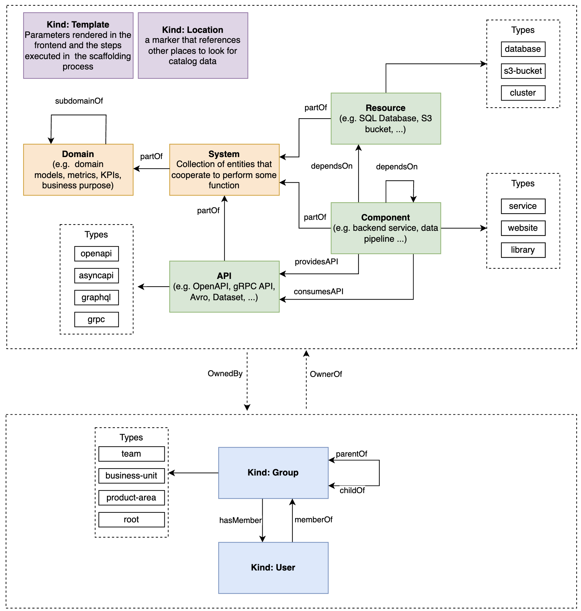
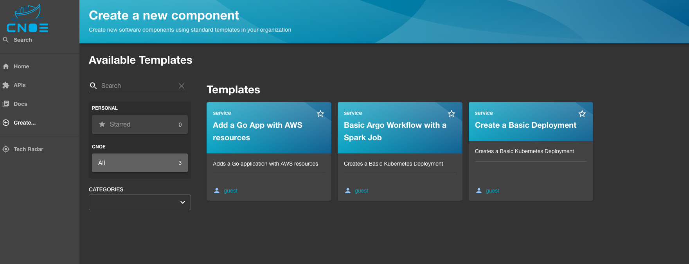
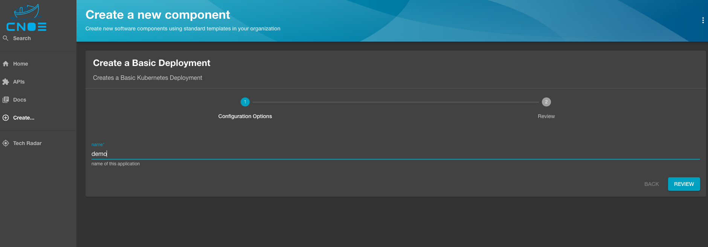
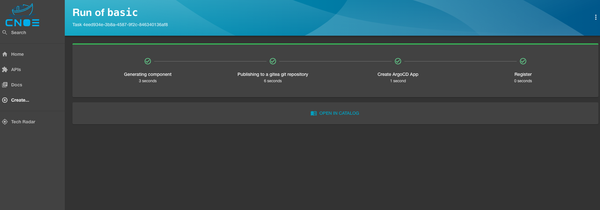

# Basic Deployment
We can now proceed with deploying a sample application deployment into the backstage. Before deep dive to this example, let's take a short look at what backstage is and some terminology is its ecosystem.

## Backstage

Backstage is an open-source platform developed by Spotify that helps teams manage and maintain infrastructure, services, and documentation in a unified interface. It provides a developer portal that centralizes internal tools, reduces complexity, and streamlines workflows by offering features such as software catalogs, documentation management, and plugin integration. It’s built with the goal of improving developer productivity by allowing them to focus on code rather than tooling and infrastructure.

### Backstage Resources Terminology

1.	`Catalog:` The Backstage catalog is the heart of the platform. It’s a centralized system where all of the services, components, APIs, and resources used by a team are registered and organized. It helps teams track ownership, dependencies, and system health.
2.	`Entity:` In Backstage, an entity is a generic term used to refer to any catalog item (such as a service, website, API, or component). Each entity has metadata like its name, owner, lifecycle stage (production, development), and relations to other entities.
3.	`Component:` A specific type of entity that refers to a piece of software or service. Components are the building blocks in a Backstage catalog and represent microservices, libraries, websites, or mobile apps within a system.
4.	`System:` A logical grouping of components that serve a larger function. Systems can contain multiple components, and this hierarchical organization helps make it easier to understand the structure of an entire application.
5.	`API:` APIs are also entities in the Backstage catalog. They represent service interfaces that define how different services or components communicate. API entities help track dependencies between services and document their usage.
6.	`Plugins:` Backstage is highly extensible via plugins. Plugins can add new features, integrate external tools, or provide custom workflows inside the Backstage portal. Examples include Kubernetes monitoring, CI/CD pipeline integration, or incident management tools.

<p align="center">
    
</p>

## Sample Application Deployment 
Let's start by deploying a simple application to the cluster through [Backstage](https://cnoe.localtest.me:8443/):
- Click on the `Create...` button on the left, then select the `Create a Basic Deployment template`.

<p align="center">
    
</p>

- In the next screen, type demo for the name field, then click `Review`, then `Create`. Once steps run, click the `Open In Catalog` button to go to the entity page.

<p align="center">
    
</p>

<p align="center">
    
</p>

- In the demo entity page, you will notice a ArgoCD overview card associated with this entity. You can click on the ArgoCD Application name to see more details.

Screenshot

### Deployment Review

- Backstage created a git repository, then pushed templated contents to it.
- Backstage created an ArgoCD Application and pointed it to the git repository.
- Backstage registered the application as a component in Backstage.
- ArgoCD deployed the manifests stored in the repo to the cluster.
- Backstage retrieved application health from ArgoCD API, then displayed it.

## Cleaning Up Resources
You can use the following command to destroy the stack:

```bash
idpbuilder delete
```