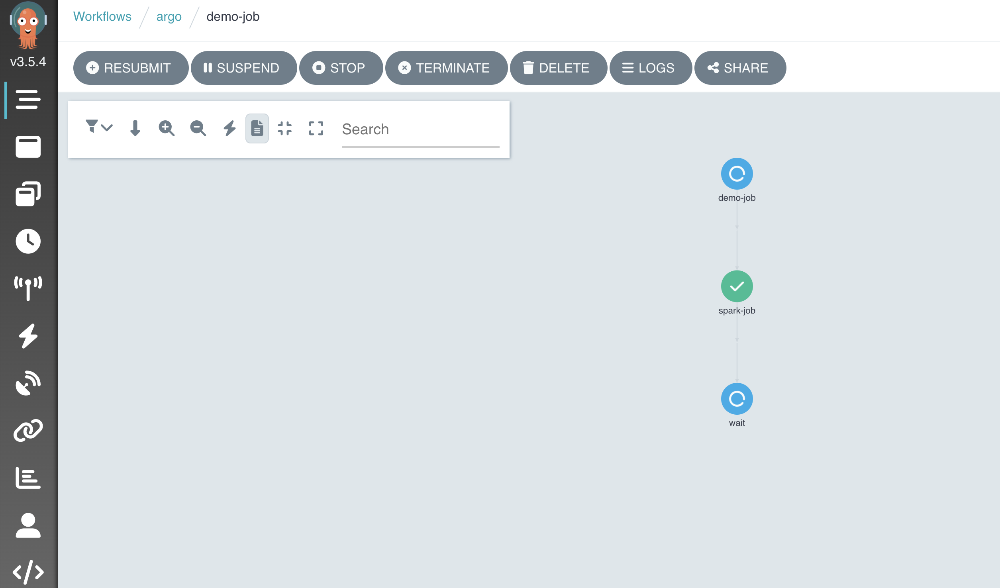

# Deploying a Spark Job via Argo Workflow in Backstage
This section explains how to deploy and manage a Spark job using Argo Workflows within Backstage. By integrating Argo with Backstage, you can automate, orchestrate, and track your distributed Spark jobs, making the deployment and management process seamless.

## Prerequisites
Before deploying a Spark job using Argo Workflow in Backstage, ensure the following:

- Backstage and Argo Workflows are correctly configured and integrated.
- The Kubernetes cluster is available, as both Argo and Spark Operator require Kubernetes to run.
- The necessary permissions and access are granted for deploying and running workflows in the cluster.

### Spark Job Deployment 
Now, we will deploy a simple Apache Spark job through Argo Workflows.
Before creating our new application, let's take a look at both [Argo Workflow and Spark job templates](https://github.com/cnoe-io/stacks/blob/main/ref-implementation/backstage-templates/entities/argo-workflows/skeleton/manifests/deployment.yaml). 

Log in to the [Backstage](https://cnoe.localtest.me:8443/):
- Click on the Create... button on the left,
- Then select the `Basic Argo Workflow with a Spark Job template`.
- Type demo-spark for the name field
- Then click create. 
- You will notice that the Backstage templating steps are very similar to the basic example in the previous part.
- Click on the Open In Catalog button to go to the entity page.

Deployment processes are the same as the first example. Instead of deploying a pod, we deployed a workflow to create a Spark job.

### Deployment Review

In the entity page, on the CI/CD tab, it should say running or succeeded:
- You can click the name in the card to go to the Argo Workflows UI to view more details about this workflow run.
- When prompted to log in, click the login button under single sign-on.
- [Argo Workflows](https://cnoe.localtest.me:8443/argo-workflows/workflows/argo?&limit=50) is configured to use SSO with Keycloak, allowing you to log in with the same credentials as Backstage login.
- We can also verify the deployment by checking the resources created in our kind cluster:

```bash
kubectl -n argocd get apps spark-operator
NAME             SYNC STATUS   HEALTH STATUS
spark-operator   Synced        Healthy

kubectl -n argo get workflows.argoproj.io -A
NAMESPACE   NAME       STATUS    AGE    MESSAGE
argo        demo-job   Running   113s

kubectl -n argo get sparkapplications.sparkoperator.k8s.io
NAME                STATUS      ATTEMPTS   START                  FINISH       AGE
spark-pi-demo-job   SUBMITTED   1          2025-06-25T08:09:17Z   <no value>   117s
```

`Note:` Argo Workflows are not usually deployed this way. This is just an example to show you how you can integrate workflows, backstage, and Spark.

Back in the entity page, you can view more details about Spark jobs by navigating to the Spark or CI/CD tab on the Backstage UI.

<p align="center">
    
</p>

## Cleaning Up Resources
You can use the following command to destroy the stack:

```bash
idpbuilder delete
```
